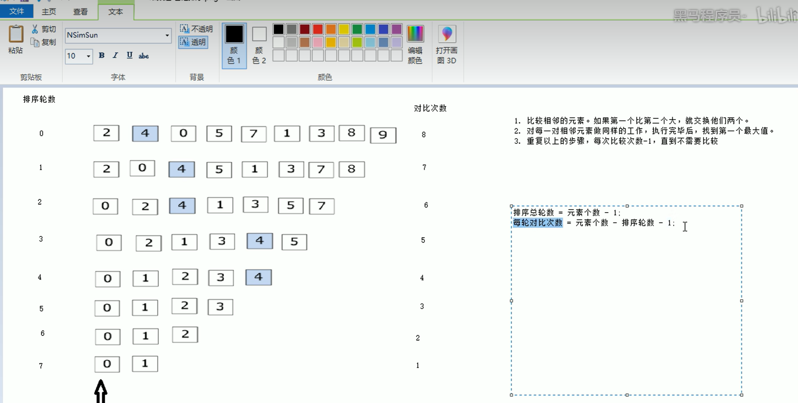

CPP的重要学习部分：
1.随机数
```c++
#include<ctime>//time()函数需要包含的头文件
int main(){
    srand((unsigned int)time(NULL));//置于时间的随机数种子
    int target=rand()%100+1
    //rand()[随机生成数字]%数字[0到这个数字的区间，也就是生成范围-1]eg:rand()%100[0~99]+1[1~100]
    return 0;
}
```
2.冒泡排序

```c
int main() {
	//利用冒泡排序做一个升序序列
	int arr[] = { 4,2,8,0,5,7,1,3,9 };
	cout << "排序前的结果： " << endl;
		for (int i = 0;i <= sizeof(arr) / sizeof(arr[0]);i++) {
			cout << arr[i] << " ";
		}
		cout << endl;
	//开始冒泡排序
	//排序的总轮数=元素个数-1
	//每轮对比次数=元素个数-排序轮数-1（轮数从0开始）
		for (int i = 0;i < 9 - 1;i++) {
			//内层循环对比
			for (int j = 0;j < 9 - i - 1;j++) {
				//第一个数字大则交换这两个数字
				if (arr[j] > arr[j + 1])
				{
					int temp = arr[j];
					arr[j] = arr[j + 1];
					arr[j + 1] = temp;
				}
			}
	}
		cout << "排序后的结果： " << endl;
		for (int i = 0;i <= sizeof(arr) / sizeof(arr[0]);i++) {
			cout << arr[i] << " ";
		}
		cout << endl;

	return 0;
}
```
